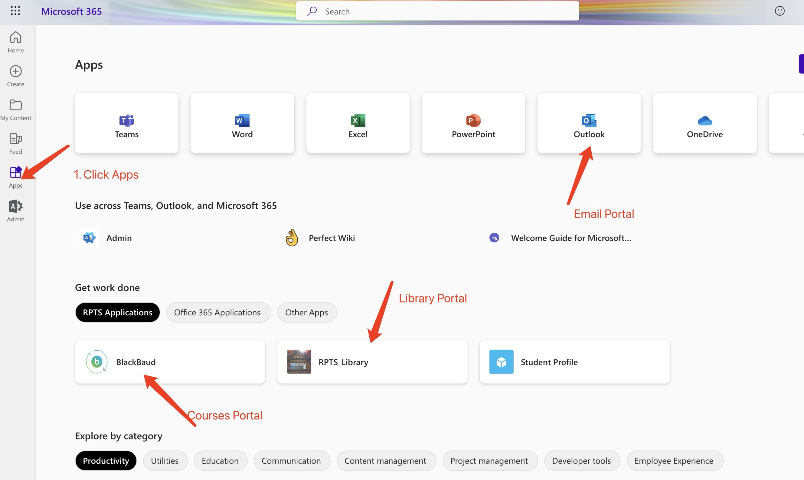
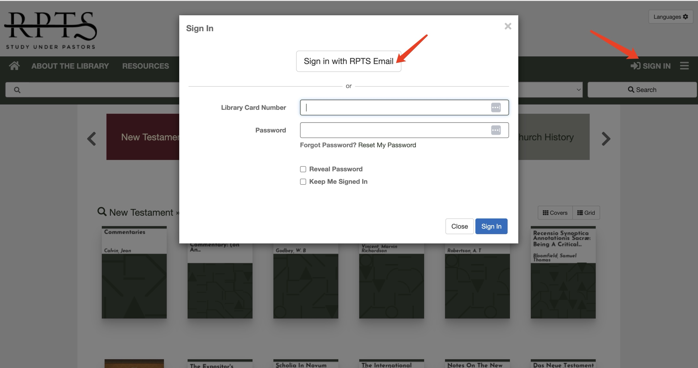

# Library Login Guidance
{: .no_toc }

## Table of contents
{: .no_toc .text-delta }

1. TOC
{:toc}

---

## Student Login  

{: .warning}
RPTS Library has been update this summer.  If you have not login to the library yet, please follow the instruction below.

### Login to your Email  
1. Login by click here [https://portal.office.com/](https://portal.office.com/)
2. Enter your school email and password 
3. You should be navigated to email page   


### Login to RPTS Library

1.At your email page, Click Apps( located at left side toolbar) > RPTS Application > RPTS Library  





2.Click Sign in --> with RPTS email --> Automatically Sign In  





### Error  

{: .note}
If you directly sign in RPTS Library for first time after this summer. You may encounter the error, and please check step 1 and 2 or contact support.  


```
Message: 
Application with identifier '.......' was not found in the directory 'RPTS'. 
This can happen if the application has not been installed by the administrator of the tenant 
or consented to by any user in the tenant. 
You may have sent your authentication request to the wrong tenant.

```


## Non-Student Login  

### Get your Library Card   

### Login with Library card number account   

Login by [Click Here to Login](https://rpts.aspendiscovery.org/){: .btn-green }  