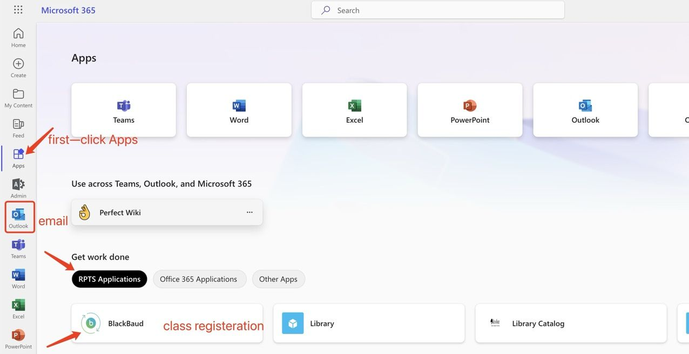

# How to Login to Email & Blackbaud
{: .no_toc }

## Table of contents
{: .no_toc .text-delta }

1. TOC
{:toc}

---

## Login to your Email  

1. Login by click here [https://portal.office.com/](https://portal.office.com/)
2. Enter your school email and password 
3. You should be navigated to email page 

## Login to your Blackbaud 

1. At your email page, Click Apps( located at left side toolbar) > RPTS Application > Blackbaud 
2. Enter your school email and it should login 

