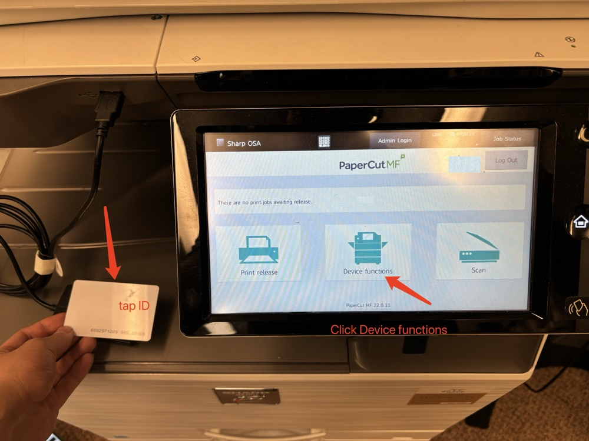
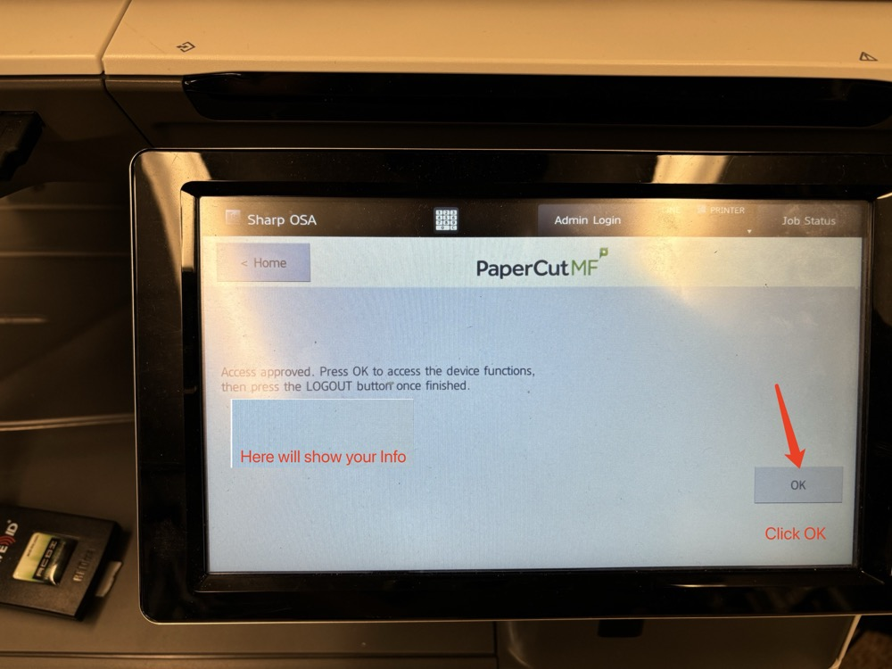
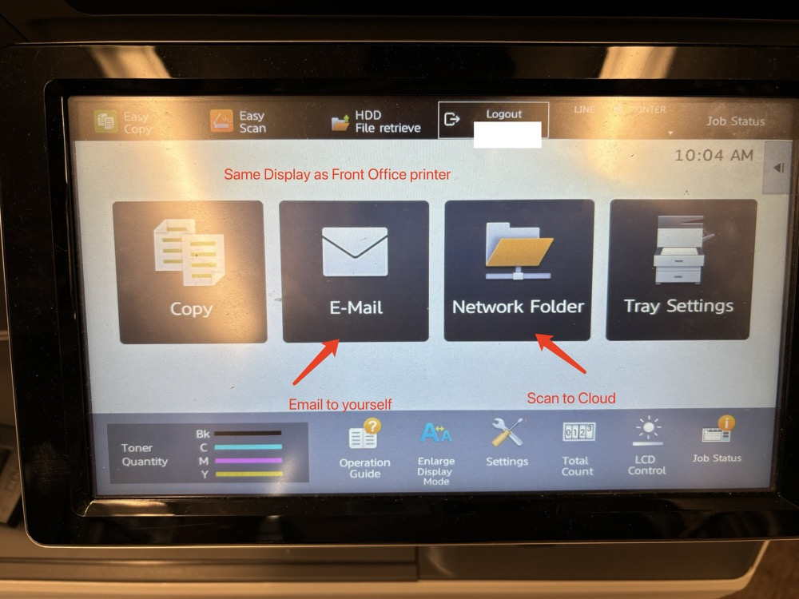
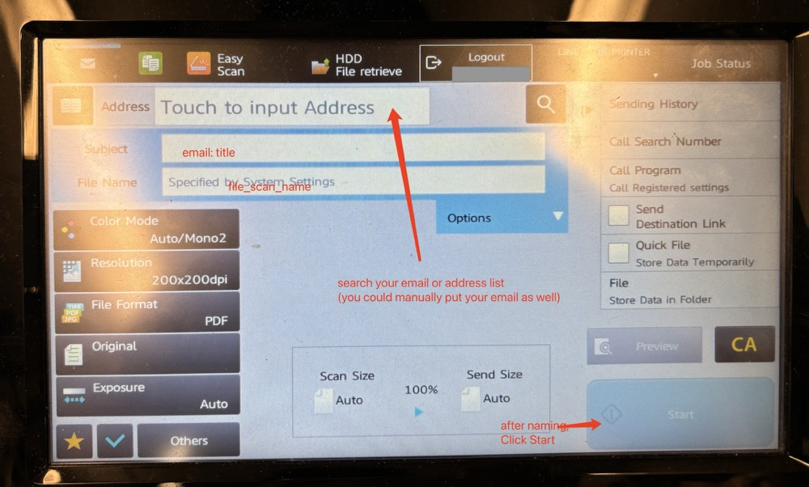
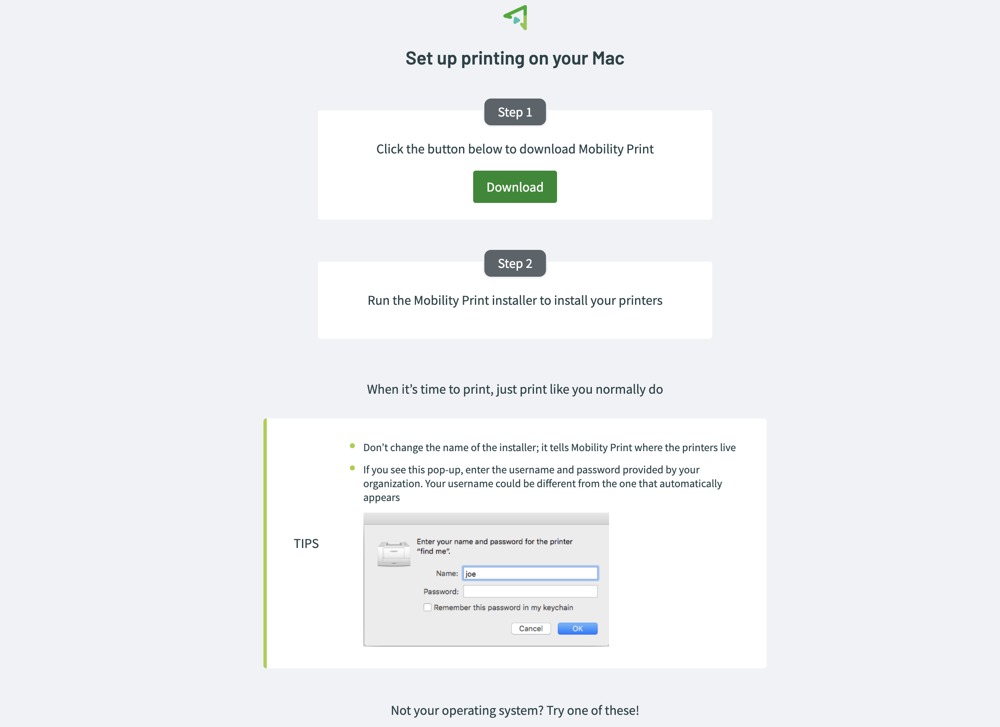

# Instruction of Printer
{: .no_toc }

## Table of contents
{: .no_toc .text-delta }

1. TOC
{:toc}

---

## Scan & Copy (Staff Only)

1. Using your ID card Or your Circle ID (if you do not have one, please contact IT)  
2. Click Device Functions
  

3. Click Ok to access main page  
    

4. Click Email or Network Folder to perform your tasks  
  

5. Enter your email info or find address list  
  

## Printing  

You must be physically present in the RPTS Building to perform this set-up. Please contact IT if you need help.
{: .note }  

1. Connect WIFI and Open your Browser  

2. Ask IT for package

3. Download file and Follow steps  

  

4. Enter your username and password (same as wifi login)

