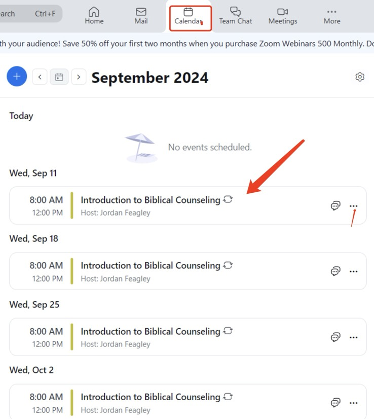

# Zoom & Teams Reacording
{: .no_toc }

## Table of contents
{: .no_toc .text-delta }

1. TOC
{:toc}

---

## Login to PC

1. Account: Rarebooks >  Please check pink stick notes for password.   

2. Login into PC  

## Zoom Recording  

{: .note}
Hit “input” on the TV remote and set to appropriate HDMI (either 1 or 2)

**1.Open Zoom**

**2.Click Calendar (on the top)**  
  

**3.Scheduled classes will show up** 
    

**4.Check the Audio**  

Microphone is located at Desktop, and plugin to charge. Press button to get receiver and micrphone connect.

  

Press both button at same time, and it will automatically connect.  

    

**5.Start the Meeting by click three dots**  

   

**6.After enter the meeting, Click the micrphone Icon to make sure setting is same as images below (red box)**    

{: .note}
Audio: Speaker is set to “Element TV”, Audio: “Wireless Go II RX” is set as the microphone
{: .note}
Video: Camera is set to “Logitech” 

   

**7.Click Record button**    

{: .note}
End video call at breaks and chapel. You will have three 50-minute videos of the class.

  

**8.After Click Record button > it should look like this > Stop button after finishing the meeting**   

    

**9.Recrods save at this location**  

## Team Recording   

**1. Open Teams --> Click Calendar (left bar)**  

  

**2. Click the class to join**  

  

**3. Open Meeting OWL in PC (search bar)**   

   

**4. Join the Meeting > Click Setting to set as below**  
  

**5. After Setting, turn on Camera > should see as below**  
    

**6. Join the Meeting**  

## Support   

If you have any questions or issue, please contact IT. 

