# Cognitoforms merging attachment as pdf to automatically uplaod to SharePoint
{: .no_toc }

## Table of contents
{: .no_toc .text-delta }

1. TOC
{:toc}

---

In this article, it demonstrates how to automate upload forms as pdf file in sharepoints.  

Encodian, Cognito Forms, Power Automate, and SharePoint has been used to achieve this goal.
{: .note }

## Automate Flow 1 > Upload to form as pdf to SharePoint  

1. Go to Power Automate in your microsoft 365
2. Create a New automated cloud flow 
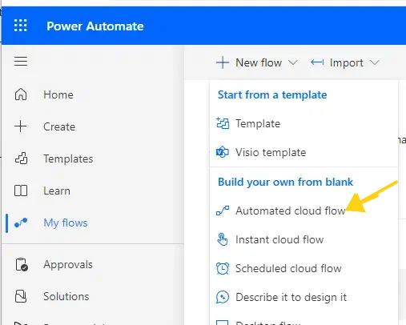

3. Search Cognito > `when a new entry is created` or `when entry is updated` 
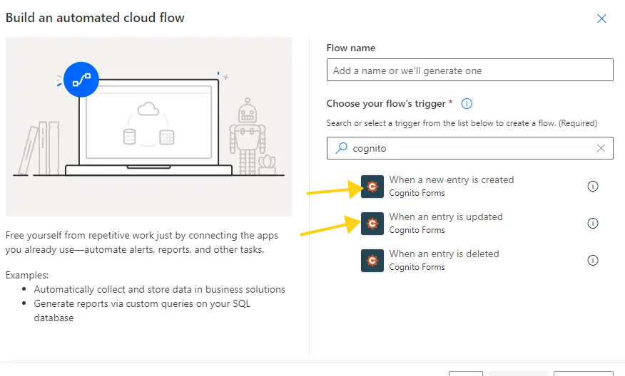

4. Click the Box > choose the Form that you want to upload to cloud  


5. Click plus button to add an action

Get Document allow you to get cognito forms in pdf version as JSON format.  

6. Add `Get Document` > add Entry Id `Entry Document1`
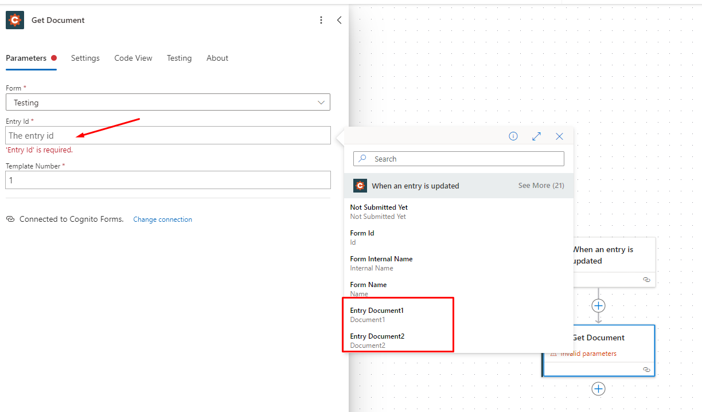
Get Document `Entry Id` is the template ID in Congito forms. In the picture, it means get forms as pdf document. Since we get pdf document, we need to store into our cloud space.  

7. Add acition `Create file` in SharePoint
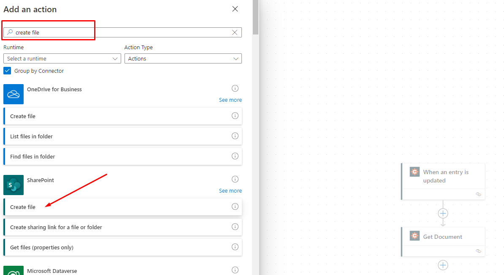
8. Configure the parameters of `Create file`
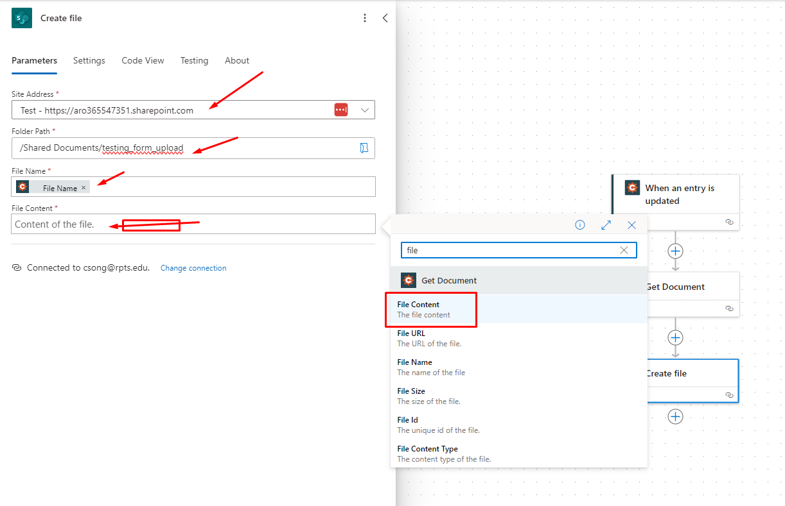
Since this testing Cognito form has pdf attachment files, we also need to get attachments (pdf documents), `Get file` is the way to get attachments.

9. Add an action `Get file` from Cognito > configure as below
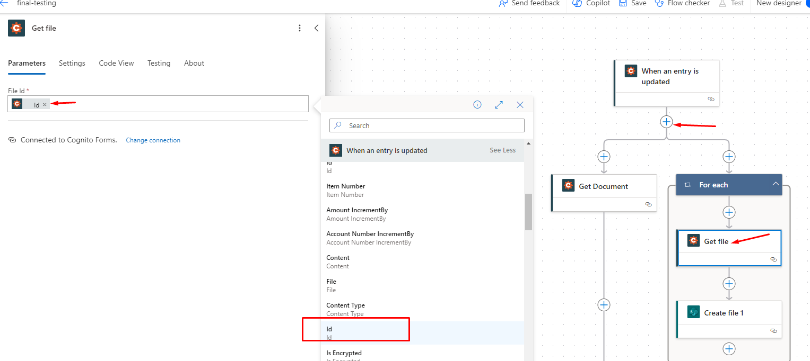
After you choose `Id`, the `for each` control will automatically appear

10. Add an action `Create file` to save attachments content in SharePoint
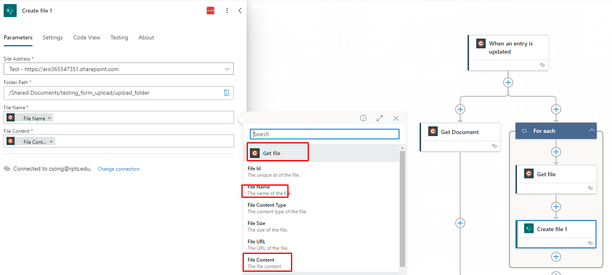

{: .note}
`Get document` is to get form pdf  
`Get file` is to get form attachments  

### Your work flow should like this(maybe slightly different)  
{: .no_toc }


So far, we have finished the Section I.


## Automate Flow 2 > Merge Mutliple pdf files into one pdf  

1. Create a New automated cloud flow > `When a file is created in a folder`
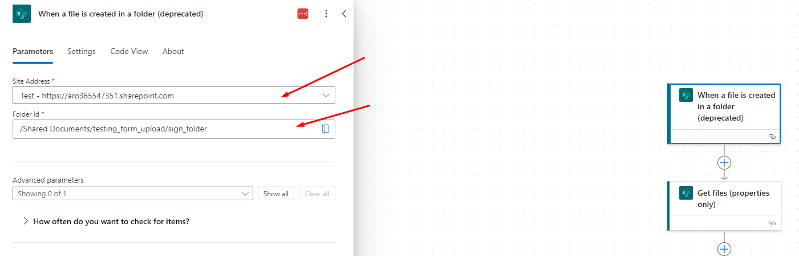

2. Add an action `Get files (proerpties only)` to get pdf meta info
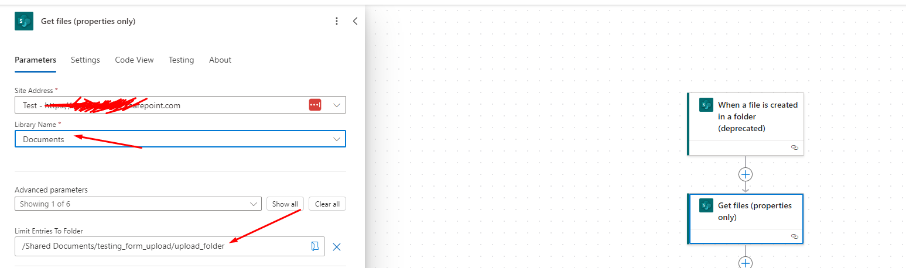

3. Add an `Initilize variable` to name `files`
we need to store multiple pdf info into a variable as an array to combine it.
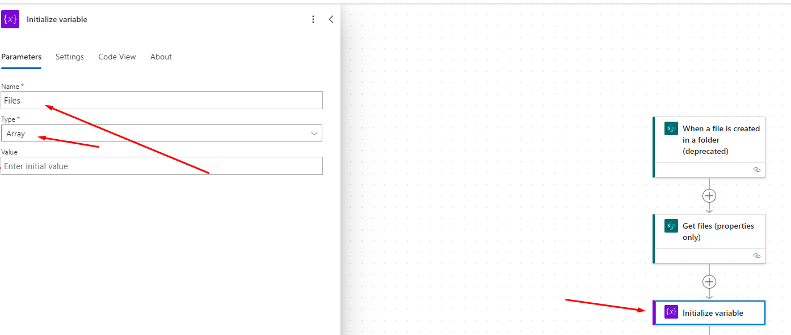

4. Add `Get file content` > `identifier` 
for each controller will appear automactially
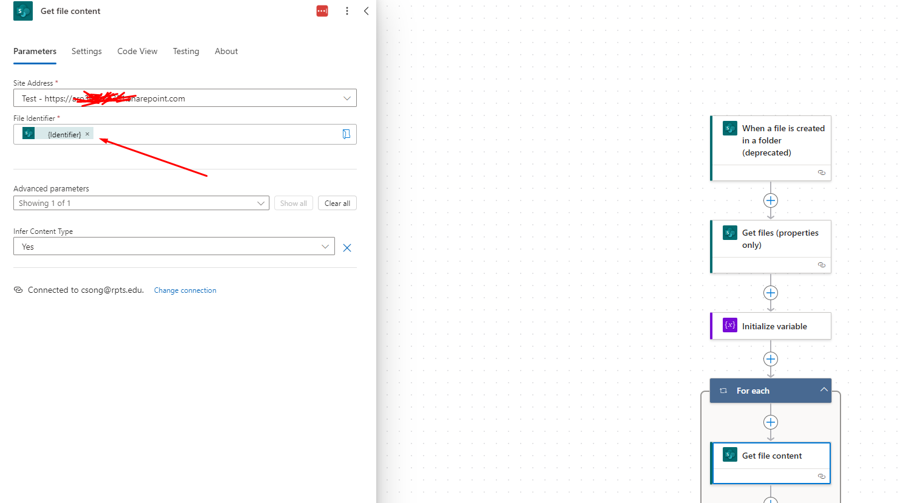

5. Add `Appened to array` to loop through all pdf documentation in a cloud folder.
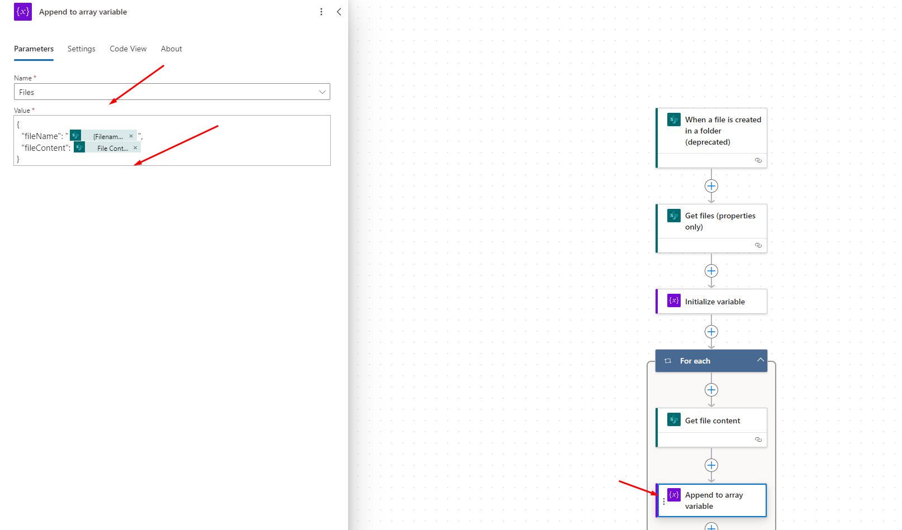
```JSON
{
   "fileName": "@{items('For_each')?['{FilenameWithExtension}']}",
   "fileContent": @{body('Get_file_content')}
}
```

6. Add `Merge document array to PDF` from `Encodian App` 
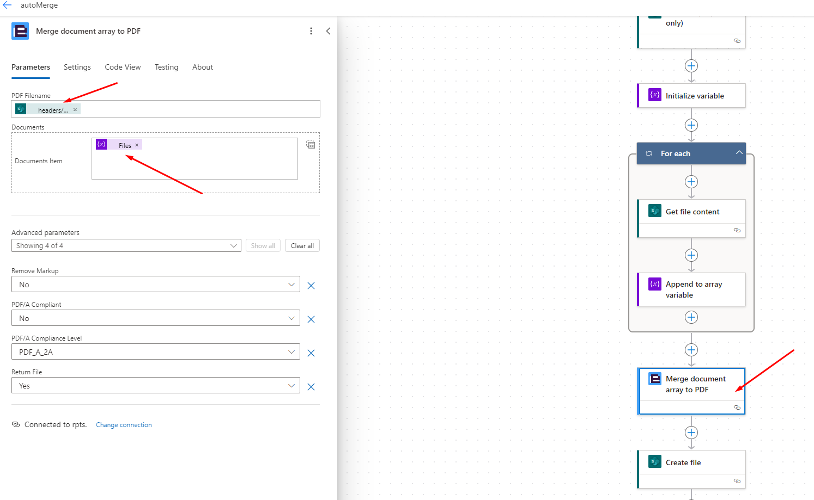


7. Add `Create file` > to store combined pdf in cloud space 
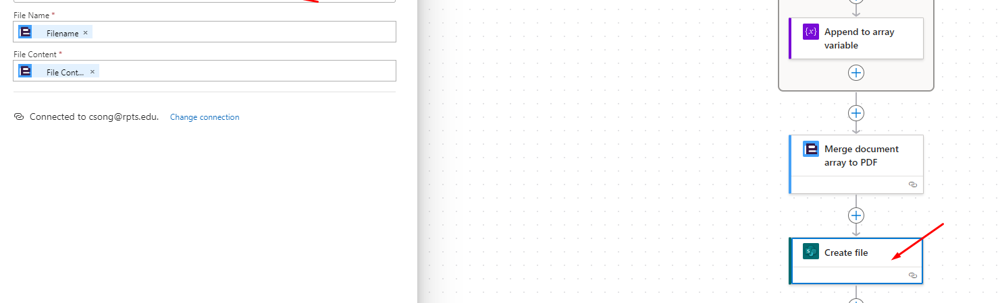


### Your work flow should like this(maybe slightly different)  
{: .no_toc }
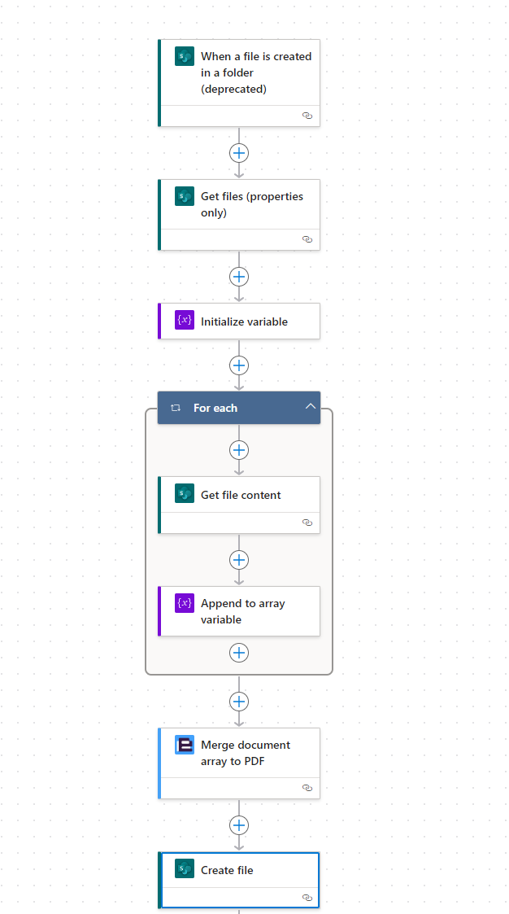


### The automate flow has been set up, test out !
{: .no_toc }


## References 
{: .no_toc }

[https://support.encodian.com/hc/en-gb/articles/360014632213-Merge-document-array-to-PDF](https://support.encodian.com/hc/en-gb/articles/360014632213-Merge-document-array-to-PDF)

[https://blog.developer.adobe.com/merging-documents-using-microsoft-power-automate-69a68e46081b](https://blog.developer.adobe.com/merging-documents-using-microsoft-power-automate-69a68e46081b)

[https://learn.microsoft.com/en-us/power-automate/getting-started](https://learn.microsoft.com/en-us/power-automate/getting-started)

[https://www.cognitoforms.com/support/63/data-integration/microsoft-flow](https://www.cognitoforms.com/support/63/data-integration/microsoft-flow)
